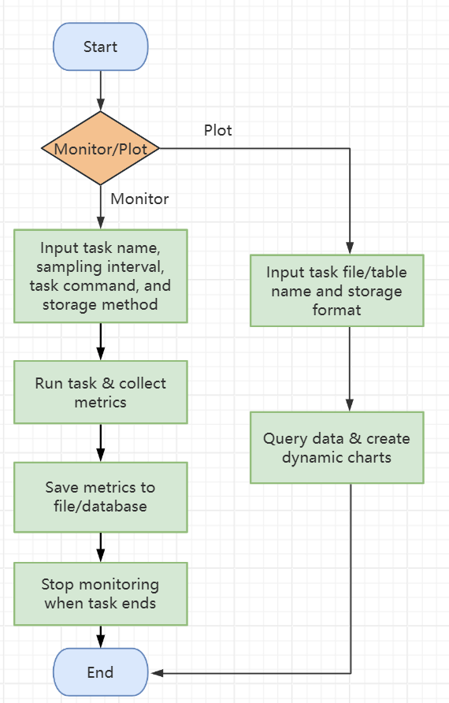
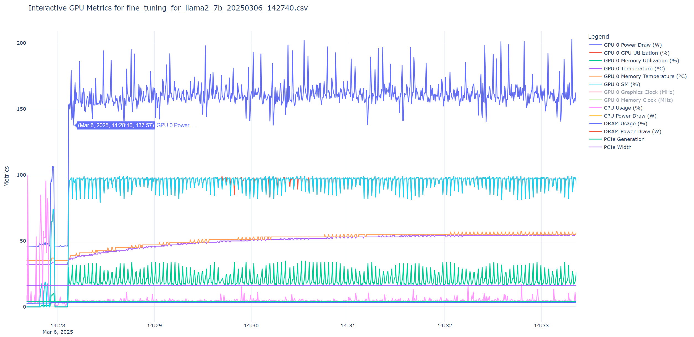

# 项目名称
能源消耗监控工具

## 项目概述

**背景**：在当前的AI研究领域（尤其是在大模型训练、超参数搜索等场景中），普遍存在一种“性能优先”的思维方式。研究人员往往将硬件资源视为几乎无限的计算单元，缺乏对GPU/CPU能耗特性（如功率波动、热耗散效率）的系统关注。随着AI任务对计算需求呈指数级增长，硬件资源的能效已成为影响研究成本和环境可持续性的关键因素。因此，有效且轻量化地监控能耗相关指标变得极为重要。目前，能耗数据的采集主要依赖研究人员手动执行nvidia-smi和perf等命令行工具，这导致数据记录和任务执行的碎片化，增加了研究人员的调试和优化工作量。

**目标**：开发一款自动化、轻量化、跨平台的监控工具，实现以下核心功能：

- 实时采集：以可配置的时间间隔捕获CPU/GPU能耗和性能指标
- 多设备支持：兼容多GPU服务器环境
- 数据持久化：提供CSV和MySQL存储选项，以满足不同规模的数据管理需求
- 可视化与分析：生成交互式图表，直观展示硬件资源利用率与能耗之间的时空关系

**成果**：一个高可用的能耗监控系统，具备以下技术规格：

- 支持0.1秒的数据采集精度（精细度取决于GPU数量及其性能）
- 兼容全系列NVIDIA GPU（基于nvidia-smi标准化输出解析）
- 优化的MySQL批量写入（事务提交频率可调，单表日均记录处理能力达千万级）
- 生成交互式HTML可视化报告（基于Plotly动态图表，支持多维数据对比）

**操作**：用户可通过运行脚本提交任务并实时监控CPU和GPU数据，数据将被保存。用户还可以利用保存的数据生成图表进行可视化与分析。

## 总体实现

### 流程图


### 1. 数据采集模块
**GPU指标采集**：使用subprocess调用nvidia-smi命令行工具并解析以下关键参数：

```Python
# 核心监控指标
GPU_QUERY_FIELDS = [
    "task_name", "cpu_usage", "cpu_power_draw", "dram_usage", "dram_power_draw", "gpu_name",
    "gpu_index", "gpu_power_draw", "utilization_gpu", "utilization_memory", "pcie_link_gen_current",
    "pcie_link_width_current", "temperature_gpu", "temperature_memory", "clocks_gr", "clocks_mem", "clocks_sm"]
```

**CPU和DRAM指标采集**：使用psutil库和RAPL接口实现多核利用率统计：

```Python
def get_cpu_info():
    return psutil.cpu_percent(interval=0.05, percpu=False)  # 全局平均利用率
```

```Python
def get_cpu_power_info(sample_interval=0.05):
    try:
        powercap_path = "/sys/class/powercap" # RAPL接口
        ......
```

### 2. 数据存储模块
**CSV存储方案**：采用追加写入模式，文件命名规则：{task_name}_{timestamp}.csv
```Python
# 数据字段与MySQL表结构严格对齐
CSV_COLUMNS = [
    'timestamp', 'task_name', 'cpu_usage', 'gpu_name', 'gpu_index',
    'power_draw', 'utilization_gpu', 'utilization_memory', ...
]
```

**MySQL存储方案**：动态建表机制（基于任务名+时间戳自动创建表），支持InnoDB引擎的事务处理：
```SQL
CREATE TABLE IF NOT EXISTS {table_name} (
    id INT AUTO_INCREMENT PRIMARY KEY COMMENT '自增ID',
    timestamp TIMESTAMP DEFAULT CURRENT_TIMESTAMP COMMENT '采集时间',
    task_name VARCHAR(50) COMMENT '任务名称',
    gpu_index INT COMMENT 'GPU设备索引',
    ...
) ENGINE=InnoDB DEFAULT CHARSET=utf8mb4;
```

### 3. 可视化模块
基于Plotly库生成动态图表，创建多维度交互式折线图：
```Python
fig.add_trace(go.Scatter(
    x=df['timestamp'], 
    y=df['power_draw'],
    mode='lines',
    name='GPU功率（W）',
    hovertemplate="<b>%{x}</b><br>功率: %{y}W"
))
```



## 项目使用说明

有关项目详细使用说明，请参阅[UserManual.md]。

**待更新**
1、`mysql`太久没更新了

2、每次运行的结果存入到`monitor_stats.log`中（引用`calculate_metrics`）

3、是否有统一日志输出和控制台输出的必要性