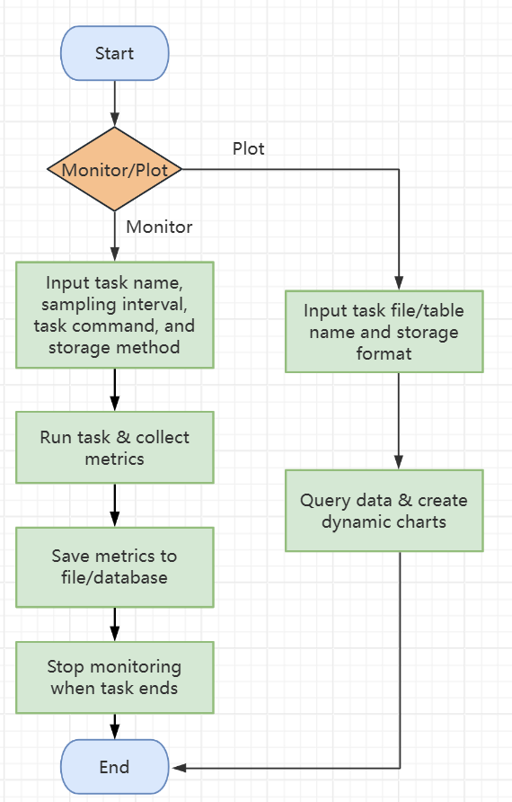

# Project Name
Energy Consumption Monitoring Tool

## Project Overview

**Background**: In the current AI research field (especially in scenarios like large model training, hyperparameter search, etc.), there is a prevalent "performance-first" mindset. Researchers often treat hardware resources as virtually unlimited computing units, lacking systematic attention to the energy consumption characteristics of GPUs/CPUs (e.g., power fluctuations, thermal dissipation efficiency). As AI tasks experience exponential growth in computational demands, the energy efficiency of hardware resources has become a critical factor influencing research costs and environmental sustainability. Therefore, effectively and lightweightly monitoring energy consumption-related metrics has become extremely important. Currently, energy consumption data collection mainly relies on researchers manually executing command-line tools like nvidia-smi and perf, which results in fragmented data recording and task execution, adding to the debugging and optimization workload of researchers.

**Objective**: To develop an automated, lightweight, cross-platform monitoring tool that implements the following core functionalities:

- Real-time collection: Capture CPU/GPU energy consumption and performance metrics at configurable time intervals
- Multi-device support: Compatible with multi-GPU server environments
- Data persistence: Provide CSV and MySQL storage options to accommodate different scales of data management needs
- Visualization and analysis: Generate interactive charts to visually display the spatiotemporal relationship between hardware resource utilization and energy consumption

**Results**: A highly available energy monitoring system with the following technical specifications:

- Supports 1-second data collection precision
- Compatible with the entire range of NVIDIA GPUs (based on nvidia-smi standardized output parsing)
- Optimized MySQL batch writing (transaction commit frequency adjustable, with a daily average record processing capacity of tens of millions per table)
- Generates interactive HTML visualization reports (based on Plotly dynamic charts, supporting multi-dimensional data comparison)

## Overall Implementation

### Flowchart


### 1. Monitoring Data Collection Module
**GPU Metrics Collection**: Use subprocess to call the nvidia-smi command-line tool and parse the following key parameters:

```Python
# Core monitoring metrics
GPU_QUERY_FIELDS = [
    "name", "index", "power.draw", "utilization.gpu", 
    "utilization.memory", "temperature.gpu", "temperature.memory",
    "clocks.gr", "clocks.mem",
    "pcie.link.width.current", "pcie.link.width.current", "sm"]
```

**CPU Metrics Collection**: Use the psutil library to implement multi-core utilization statistics:

```Python
def get_cpu_info():
    return psutil.cpu_percent(interval=1, percpu=False)  # Global average utilization
```

### 2. Data Storage Module
**CSV Storage Solution**: Append-write mode is used, and file naming convention: {task_name}_{timestamp}.csv
```Python
# Data fields and MySQL table structure strictly aligned
CSV_COLUMNS = [
    'timestamp', 'task_name', 'cpu_usage', 'gpu_name', 'gpu_index',
    'power_draw', 'utilization_gpu', 'utilization_memory', ...
]
```

**MySQL Storage Solution**: Dynamic table creation mechanism (automatically create tables based on task name + timestamp), supporting transaction processing with the InnoDB engine:
```SQL
CREATE TABLE IF NOT EXISTS {table_name} (
    id INT AUTO_INCREMENT PRIMARY KEY COMMENT 'Auto-incremented ID',
    timestamp TIMESTAMP DEFAULT CURRENT_TIMESTAMP COMMENT 'Capture time',
    task_name VARCHAR(50) COMMENT 'Task name',
    gpu_index INT COMMENT 'GPU device index',
    sm FLOAT COMMENT 'SM utilization rate (%)',
    ...
) ENGINE=InnoDB DEFAULT CHARSET=utf8mb4;
```

### 3. Visualization Module
Dynamic chart generation based on the Plotly library, creating interactive line charts with multiple dimensions:
```Python
fig.add_trace(go.Scatter(
    x=df['timestamp'], 
    y=df['power_draw'],
    mode='lines',
    name='GPU Power (W)',
    hovertemplate="<b>%{x}</b><br>Power: %{y}W"
))
```

## Project Usage Instructions

For detailed project usage instructions, please refer to [UserManual.md].