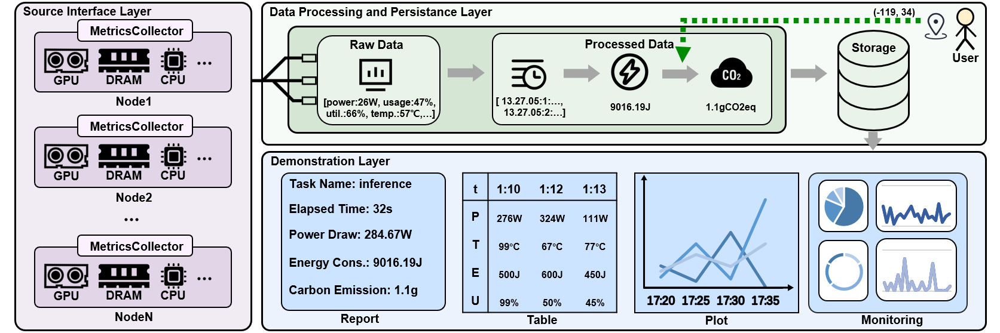

# WattsOnAI 📊



A comprehensive software toolkit for the measurement, analysis, and visualization of energy use, power draw, hardware performance, and carbon emissions across AI workloads.

---

## Features ✨

* **Unified Metrics**: Real-time energy, power, carbon & hardware data; synced high-resolution sampling.
* **Easy Integration**: Simple Python plug & play; ultra-low performance overhead.
* **Advanced Analytics**: Multi-dimensional visuals & correlation for deep energy, carbon & hardware insights.
* **Smart Reporting & Export**: Auto post-task reports (with carbon summary); flexible CSV/MySQL export.

---

## Installation ⚙️

### Prerequisites

* Python 3.8+
* Linux or WSL (for `dcgm`)
* MySQL (optional, for DB output)
* NVIDIA GPU with drivers properly installed

### Install Python Dependencies

```bash
pip install -r requirements.txt
```

### Install NVIDIA DCGM (Datacenter GPU Manager)

```bash
sudo apt-get update
sudo apt-get install -y datacenter-gpu-manager
```

---

## Usage 🛠️

### Step 1: Configuration

* If logging to **MySQL**, edit `config.py` with your database credentials.
* If logging to **CSV**, no changes needed.

---

### Step 2: Import

```python
from Metrics_Counter import monitor, draw
```

---

### Step 3: Start Monitoring

```python
monitor.start(
    task_name="clean",                    # Task name (optional tag)
    sampling_interval=1,                 # Sampling interval in ms (e.g., 0.5, 1, 2)
    output_format="csv",                 # "csv" or "mysql"
    additional_metrics=[],               # Optional: ['CPU', 'DRAM', 'Gdetails', 'fp64', 'fp32', 'fp16']
    indices=[0, 1, 2]                    # GPU indices to monitor, empty = all
)

# your_code

monitor.stop()
```

#### More Examples

```python
# Monitor all GPUs, output to MySQL, with CPU/DRAM metrics
monitor.start(task_name="exp1", sampling_interval=0.5, output_format="mysql", additional_metrics=['CPU','DRAM'])

# Monitor with Gdetails
monitor.start(task_name="exp2", sampling_interval=0.7, output_format="csv", additional_metrics=['Gdetails'])

# Monitor with advanced metrics
monitor.start(task_name="exp3", sampling_interval=1, output_format="csv", additional_metrics=['CPU','DRAM','Gdetails','fp64','fp32','fp16'])
```

---

### Step 4: Visualize

```python
# Draw from a CSV file located at '/home/clean_20250421_142525.csv'
draw.draw_csv(table_path='/home/clean_20250421_142525.csv')

# Draw data from the MySQL table named 'clean_20250421_133841'
draw.draw_mysql(table_name='clean_20250421_133841')
```
---

## License 📄

This project is licensed under the MIT License – see the `LICENSE` file for details.

